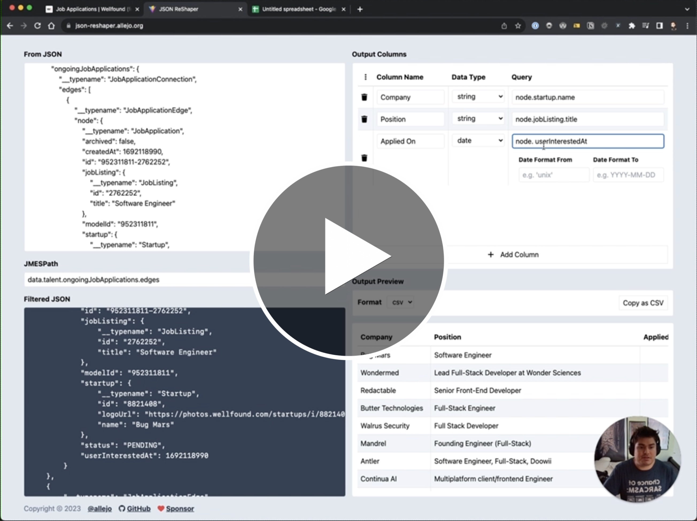
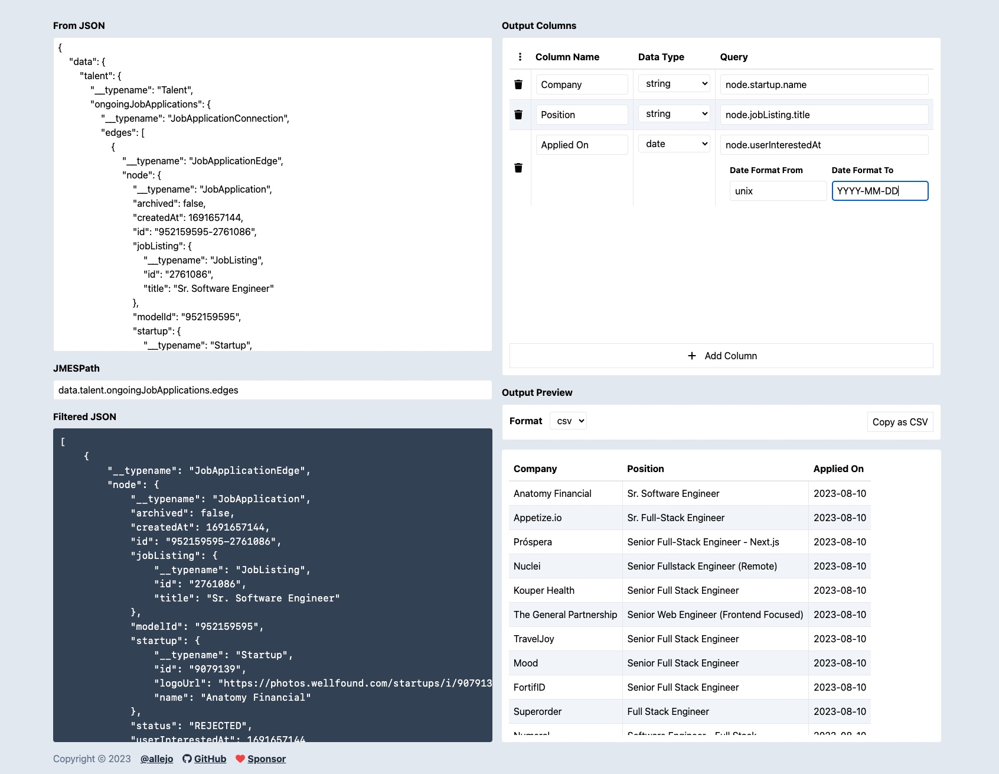

# JSON ReShaper

The fundamental problem of converting from JSON to CSV is that JSON allows for nesting objects and arrays, whereas CSV doesn't allow for that. So any quick conversion from JSON to CSV will result in some very less than ideal CSV, but that ends today! JSON ReShaper is a React app that allows you to define how to convert your JSON into CSV.

Check it out in Action!

[](https://www.loom.com/share/1ce25997383b4c638a6dbf2dd05f4965?sid=b9bbed7b-7611-4eb7-8fbf-e5d8157ede9b)

## How to Use JSON ReShaper

Got your interest? Sweet! Now you can learn how to use it and what each component of the app does.



### From JSON

This text box is where you will put in the JSON you want to convert into CSV; this will be known as your _input JSON_. Whenever you paste JSON into this field, it will automatically be formatted. Or you can type out your JSON manually, but who would want to do that?

### JMESPath

This field is where you can specify a [JMESPath](https://jmespath.org) query that will applied to your _input JSON_. The result of this query **must** return an array of objects, otherwise things will not work as your expect them to.

### Filtered JSON

The _filtered JSON_ component is a visual preview of the JSON that will be iterated over; this should be an array of objects. Each object should be thought of as being a "row" in a CSV file.

### Output Columns

This is where you define what columns your CSV file will have. Each column has a JMESPath query to select what information from said object from the _filtered JSON_ will be used as the value for that column.

If you need support for parsing timestamps, you can select the `date` data type and it will give you two extra fields; what date format is the value currently in (i.e. what format does the _filtered JSON_ have it in) and what date format you want to be used in the CSV data. This project uses [dayjs' formatting](https://day.js.org/docs/en/display/format) to parse and write timestamps.

For handling unix timestamps or epoch time (seconds since Jan 1 1970), you may use the special keyword `unix` instead of a date format.

### Output Preview

This section contains what your CSV will look like when opened up in a spreadsheet software.

> [!NOTE]
> If you would like to copy/paste this data directly into a spreadsheet, change the output to TSV (tab-separated values), and hit the copy button. Now, you will be able to paste directly into a spreadsheet.

## Contributing

This repo follows the standard setup for a React 18 application managed by Vite. We use Tailwind CSS, along with PostCSS to add support for some future features, such as nesting. The core application is written in TypeScript and we use EditorConfig and Prettier to keep the formatting of the codebase consistent.

### Setting up for development

If you would like to contribute to this project by adding new features or fixing bugs, please communicate what you intend to work on by [creating or commenting on an issue](https://github.com/allejo/json-reshaper/issues) or pull requests.

To get your local development setup so you can test your work, use the following steps:

1. Clone the repository from GitHub
2. Install all the dependencies
   ```bash
   npm install
   ```
3. Run the local development version
   ```
   npm run dev
   ```
4. Lastly, run the unit tests
   ```bash
   npm test
   ```
